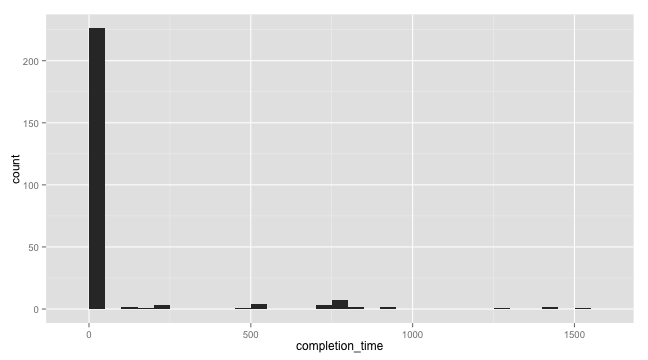
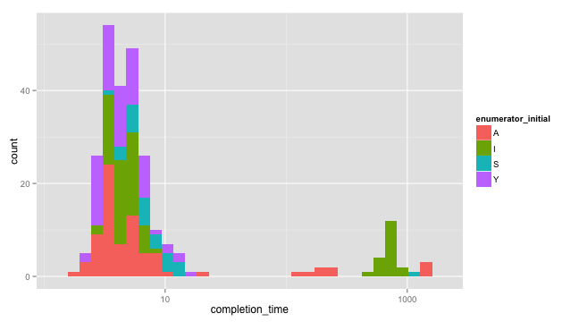

<link href="http://kevinburke.bitbucket.org/markdowncss/markdown.css" rel="stylesheet"></link>
Quality control -- how long did survey authoring take?
========================================================

formhub.R makes is easy to download and work with datasets on [formhub](http://formhub.org). If you haven't read the [basics document](http://SEL-Columbia.github.com/formhub.R/demo/Basics_of_formhub.R.html), I recommend that you read that first. In this showcase, we will demonstrate how to figure out how long enumerators take to enter survey data, and correlate completion time with enumerator and date of survey. 

After reading the dataset, we want to prepare two basic fields, the first one, `completion_time` will denote how long it took someone to fill the survey out. The second will be the enumerator's initial (which in this case is completely identifying, and helps us process multiple spellings).


```r
library(formhub)
formhubData <- formhubRead("~/Downloads/Some_Data.csv", "~/Downloads/Some_Form.json")
some_data <- data.frame(formhubData)

# first subtract start time from end time, then, convert that to minutes
some_data$completion_time <- some_data$end - some_data$start
some_data$completion_time <- some_data$completion_time/eminutes(1)

# install.packages(c('stringr','ggplot2')) if you don't have ggplot2 or
# stringr installed yet
library(stringr)
some_data$enumerator_initial <- factor(toupper(str_extract(some_data$research_asst_name, 
    "[a-zA-Z]")))
```


Now, we can start plotting. Lets start with completion time.

```r
library(ggplot2)
qplot(data = some_data, x = completion_time)
```

 


Looks like most of the time, it is taking a short amount of time, but that some time, it takes quite a while (1000 minutes ~ 24 hours; the longest survey is getting finished up a day after it was opened). 

Lets scale the x-axis by taking a log for a better display, and see which enumerators are taking the longest:

```r
qplot(data = some_data, x = completion_time, fill = enumerator_initial) + scale_x_log10()
```

 


Look like "A" and "I" filled out quite a few surveys over long spans of time, but "Y" never did, and "S" did, but only once. Maybe we should explore a little further, to see if there are patterns according to *when* the survey was done that explain the time it took to fill out each survey..


```r
# note: fill, which applies for histograms, is now color, for a point-plot
qplot(data = some_data, x = completion_time, color = enumerator_initial, y = date) + 
    scale_x_log10()
```

 


Interestingly, in this particular instance, the surveying seems to have been done in two "batches", and almost all the surveying that took a long time seems to have happened on the first day. Kudos to the survey team in charge--they seemed to have ironed out errors early!


