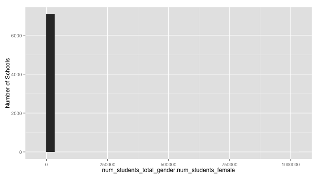
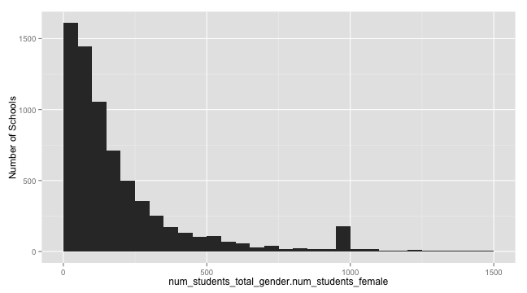
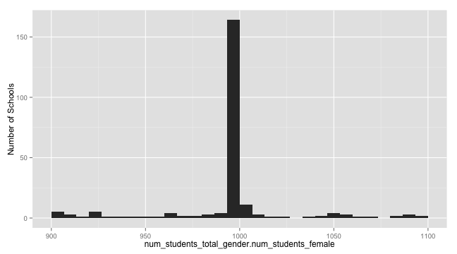
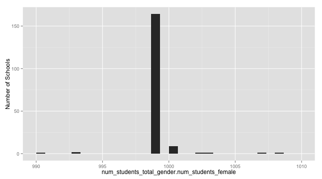
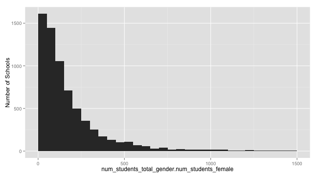
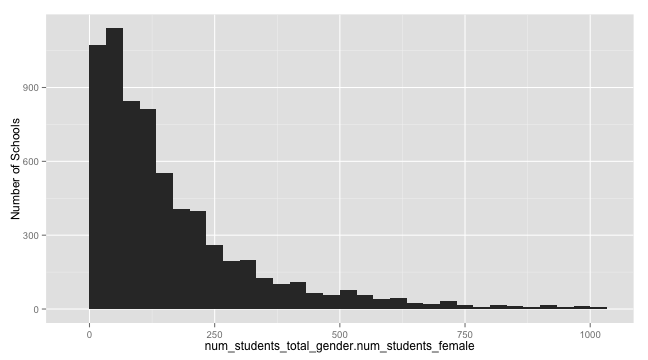
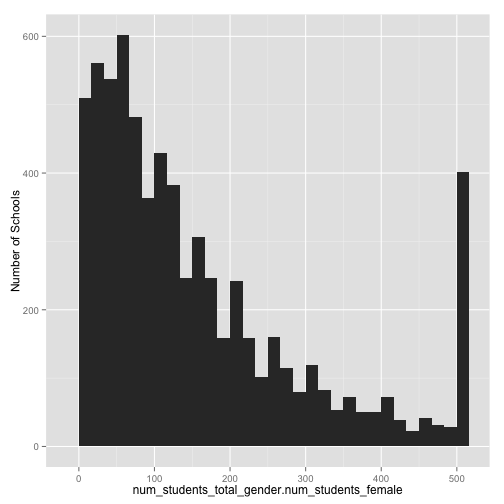

<link href="http://kevinburke.bitbucket.org/markdowncss/markdown.css" rel="stylesheet"></link>
Data Cleaning - How to remove outliers & duplicates
==============================
  
After learning to [read formhub datasets into R](http://modilabs.github.com/formhub.R/demo/Basics_of_formhub.R.html), you may want to take a few steps in cleaning your data. In this example, we'll learn step-by-step how to select the variables, paramaters and desired values for outlier elimination. 

Begin with reading in your data set... we'll use an example data set about schools.
  

```r
library(formhub)
formhubData <- formhubRead("~/Downloads/MyDataSet.csv", "~/Downloads/MyForm.json")
my_data <- as.data.frame(formhubData)
```


followed by selecting a variable that you want to do outlier work on. Let's look at the total amount of female pupils per school for this particular data set, labeled as `num_students_total_gender.num_students_female`.  


```r
library(ggplot2)
qplot(data = my_data, x = num_students_total_gender.num_students_female) + ylab("Number of Schools")
```

 


A quick eye-balling of the plot tells us that there are a couple of female student outliers that are quite high - as indicated by the extension of x-axis to 5000. Zooming in our plot may help look at the distribution better:   


```r
qplot(data = my_data, x = num_students_total_gender.num_students_female) + ylab("Number of Schools") + 
    xlim(c(0, 1500))
```

 


Round 1: na.strings
----------------
There is a weird-looking spike at 1000. If we zoom in, the problem looks to be right around 1000.

```r
qplot(data = my_data, x = num_students_total_gender.num_students_female) + ylab("Number of Schools") + 
    xlim(c(900, 1100))
```

 

```r

qplot(data = my_data, x = num_students_total_gender.num_students_female) + ylab("Number of Schools") + 
    xlim(c(990, 1010))
```

 


Oh, looks like the spike is of the value "999", which (in its negative version) is often used as a "Do Not Know" type of value in surveys. R lets us deal with individual vlaues like this by specifying an `na.strings` parameter when reading in csvs; this is exposed in the formhubRead function. So we can get rid of this value by re-reading our dataset while providing the na.strings parameter:

```r
formhubData <- formhubRead("~/Downloads/MyDataSet.csv", "~/Downloads/MyForm.json", 
    na.strings = c("999"))
my_data <- as.data.frame(formhubData)
qplot(data = my_data, x = num_students_total_gender.num_students_female) + ylab("Number of Schools") + 
    xlim(c(0, 1500))
```

 

Phew, no weird spike near 1000!

Round 2: outlier cut-offs
----------------
However, our super-high outlier is still present at the dataset. At this zoom level, we that the vast majority of schools have less than 500 female pupils. For the sake of crudely setting our outlier paramaters, let's say that any facility reporting to have over 1000 female pupils will be counted as an outlier. We write the following `outlierReplace` function, which will take a dataframe, a number of columns, a number of rows, and the new value to set to it (which we'll default to `NA`). This function makes it easy to write outlier-replacement commands, which you'll see below. You should feel free to copy this into your R scripts to do outlier replacements yourselves.


```r
# install.packages('data.table') may need to be run if you don't have the
# package
library(data.table)
outlierReplace = function(dataframe, cols, rows, newValue = NA) {
    if (any(rows)) {
        set(dataframe, rows, cols, newValue)
    }
}
```


Now, we will call `outlierReplace` on our dataset, where we'll replace all values in the column `num_students_total_gender.num_students_female`, for all rows in which the value is > 1000, with NA. Afterwards, we'll plot the graph without adjusting the x-axis, and see that the extreme value has been removed.

```r
outlierReplace(my_data, "num_students_total_gender.num_students_female", which(my_data$num_students_total_gender.num_students_female > 
    1000), NA)

qplot(data = my_data, x = num_students_total_gender.num_students_female) + ylab("Number of Schools")
```

 


It is also possible to use the `outlierReplace` function to change the value of more than one data point. Using the same outlier limit of 1000 for instance, we can change both the number of female pupils and the total number of pupils to NA like so:


```r
outlierReplace(my_data, c("num_students_total_gender.num_students_female", "num_students_total_gender.num_students_total"), 
    which(my_data$num_students_total_gender.num_students_female > 1000), NA)
```


Finally, instead of of changing outliers to NA, we could make them equal to a maximal number. To do this, and show you a clear results, we'll take all observations with more than 500 female students, and cap them at 500.


```r
outlierReplace(my_data, "num_students_total_gender.num_students_female", which(my_data$num_students_total_gender.num_students_female > 
    500), 500)
qplot(data = my_data, x = num_students_total_gender.num_students_female) + ylab("Number of Schools")
```

 

Note that the data has a much narrower range, and a spike at 500 now.


Caveat: don't replace data; undoing may require re-tracing steps
----------------------------------------------------------------

Note that the `outlierReplace` function above actually replaces your dataset. Our cap of 500 now is built into the dataset. Thankfully, however, this isn't saved into our data. We can just re-read our dataset, re-trace our steps upto right before capping things at 500 to get a good dataset back.


```r
formhubData <- formhubRead("~/Downloads/MyDataSet.csv", "~/Downloads/MyForm.json")  # actually, this step isn't strictly necessary; as formhubData has never been replaced
my_data <- as.data.frame(formhubData)
outlierReplace(my_data, c("num_students_total_gender.num_students_female", "num_students_total_gender.num_students_total"), 
    which(my_data$num_students_total_gender.num_students_female > 1000, NA))
```


Saving your dataset
-----------------------
Don't forget to save your new data set!

```r
write.csv(my_data, "~/Desktop/my_data_OutlierCleaned")
```

