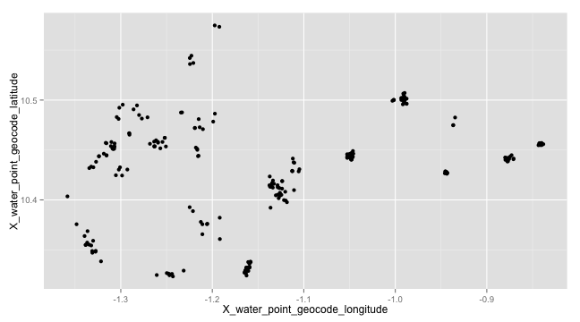
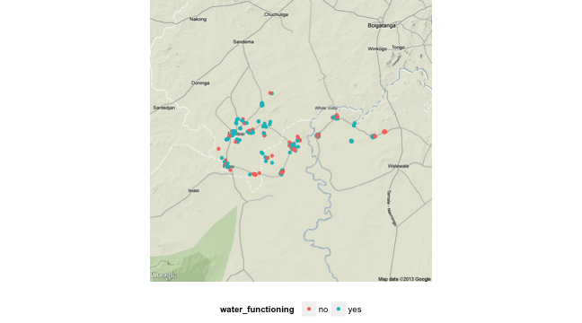
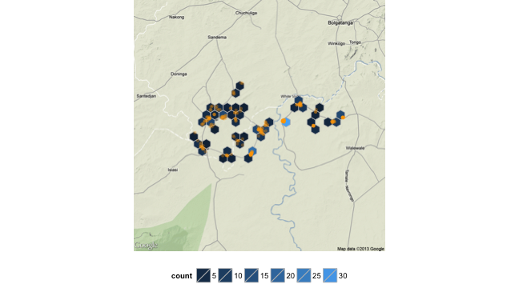
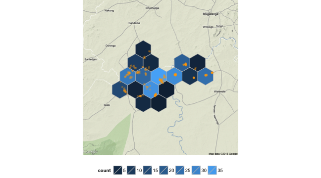
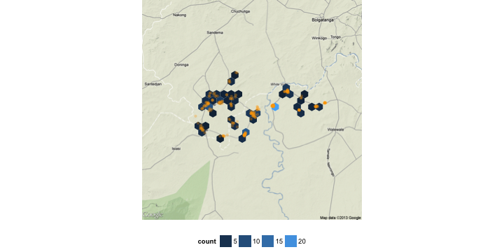

<link href="http://kevinburke.bitbucket.org/markdowncss/markdown.css" rel="stylesheet"></link>
Making maps using formhub.R
========================================================

formhub.R makes is easy to download and work with datasets on [formhub](http://formhub.org). In this example, I'll show off how formhub.R makes it easy to make printable maps... similar to the ones available on formhub.org for you to view.

This time, we'll be using a water point dataset. I am not at liberty to show you the full dataset, but maps aren't a problem. Plus, that gives me an excuse to demonstrate how formhub.R can import datasets from a file. The inputs required are two files, the `csv` file that makes up your data and the `form.json` file, which is a convenient representation of the XLSform used to collect data in the first place.


```r
# Read water points dataset directly from saved data and form.
library("formhub")
waterpoints <- data.frame(formhubRead("~/Downloads/_08_Water_points_train3_2012_09_06.csv", 
    "~/Downloads/_08_Water_points_train3.json"))
```


A quick `str(waterpoints)` can verify that the type conversions have been done properly; output excluded for brevity here.

Lets get to maps! A quick one just to help us get the lay of the land (longitude / latitudes are just x / y co-ordinates after all).

```r
# install.packages(c('ggmap','ggplot2')) if you don't have ggmap or gplot2
# installed yet
library(ggplot2)
qplot(data = waterpoints, x = X_water_point_geocode_longitude, y = X_water_point_geocode_latitude)
```

 


In order to get a real map background in there, we'll use the ggmap package, and create a baselayer for our mapping purposes. 


```r
library(ggmap)
center_point <- c(lon = mean(waterpoints$X_water_point_geocode_longitude, na.rm = T), 
    lat = mean(waterpoints$X_water_point_geocode_latitude, na.rm = T))
ngbaselayer <- ggmap(get_map(location = center_point, source = "google", filename = "maptemp", 
    zoom = 10), extent = "device") + opts(legend.position = "bottom")
```


Now, we can think about a variable to visualize--how about `water_functional` (which corresponds to the question: Is the water source able to provide water right now?)


```r
ngbaselayer + geom_point(data = waterpoints, aes(x = X_water_point_geocode_longitude, 
    y = X_water_point_geocode_latitude, color = water_functioning))
```

 


And here is a hexagonal binning of the counts in this dataset (with points laid over transparently), with two different bin sizes:

```r
ngbaselayer + 
   stat_binhex(data=waterpoints, color="grey", # bins = 30 by default
         aes(x=X_water_point_geocode_longitude, y=X_water_point_geocode_latitude)) + 
   geom_point(data=waterpoints, color="orange", alpha=0.3,
         aes(x=X_water_point_geocode_longitude, y=X_water_point_geocode_latitude))
```

 

```r

ngbaselayer +
  stat_binhex(data=waterpoints, color="grey", bins=10,
         aes(x=X_water_point_geocode_longitude, y=X_water_point_geocode_latitude)) + 
   geom_point(data=waterpoints, color="orange", alpha=0.3,
         aes(x=X_water_point_geocode_longitude, y=X_water_point_geocode_latitude))
```

 


Unfortunately, I'm not quite sure how we can replicate the formhub.org-style density hexbins, which tell us areas in which a high proportion of existing water points are non-functional. However, we can map where there is a preponderence of non-functioning water points within our set, overlaying all points for contrast:

```r

only_functioning_points <- subset(waterpoints, water_functioning == "yes")
ngbaselayer + stat_binhex(data = only_functioning_points, aes(x = X_water_point_geocode_longitude, 
    y = X_water_point_geocode_latitude)) + geom_point(data = waterpoints, alpha = 0.3, 
    color = "orange", aes(x = X_water_point_geocode_longitude, y = X_water_point_geocode_latitude))
```

 


Pretty cool, eh?
In Making Maps II with formhub.R, we will show how to make choropleth maps using shapefiles downloaded from [gadm](http://gadm.org).
